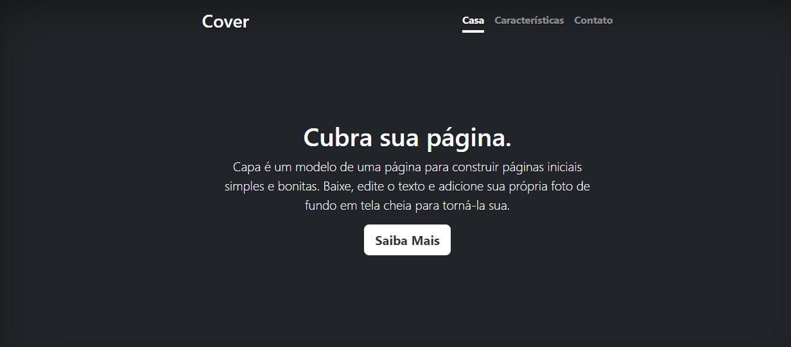

# Indice 

[Projeto de portifolio pessoal](#portifolio-pessoal)  
[Descrição](#descri%C3%A7%C3%A3o)  
[Introducão](#introduc%C3%A3o)  
[Funcionalidades](#funcionalidades)  
[Tecnologias utilizadas](#tecnologias-utilizadas)  
[Fontes consultadas](#fontes-consultadas)  
[Autores](#autores)  

# portifolio-pessoal

Projeto criação utilizando exemplo do Bootstrap para ensino de uso do README e do Bootstrap

## Descrição 

## Introducão 

## Funcionalidades

## Tecnologias utilizadas 

## Fontes consultadas

## Autores 